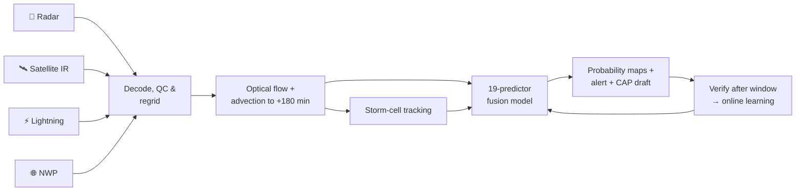

<div align="center">

# ⚡ VAJRA AI

### AI/ML-Based Thunderstorm & Lightning Nowcasting Portal


**Team Innovation Insurgents** · Team ID 144769 · SPIT, Mumbai


</div>

> [!IMPORTANT]
> VAJRA AI is an experimental prototype built for Smart India Hackathon 2026. Its outputs are **not official IMD warnings**.

## 🎯 Problem Statement

**SIH26072:** *AIML based Nowcasting of thunderstorm and lightning using atmospheric observation including multiple radars, satellite, lightning and model data*
Ministry of Earth Sciences (MoES) · India Meteorological Department (IMD) · Disaster Management · Software

Thunderstorms and lightning develop within minutes and cause loss of life, crop and infrastructure damage and power outages. Conventional forecasts are too coarse, and radar extrapolation alone misses new storms forming.

## 💡 What is VAJRA AI?

VAJRA AI combines what radars, satellites, lightning sensors and weather models see **right now** to predict whether a thunderstorm or lightning will hit a given place in the next **30 minutes to 6 hours**. It also says how confident it is and why. Each forecast is later checked against what actually happened and used to improve the model.

| **4 data families** | **30 min – 6 h** | **19-predictor** | **ROC AUC 0.974** | **< 1 s** |
|:---:|:---:|:---:|:---:|:---:|
| Radar · Satellite · Lightning · NWP | forecast windows | fusion model with online learning | lightning classifier (2022 test) | runtime per location |

## ✨ Key Features

- 🛰️ **Multi-source fusion:** radar mosaic, Himawari-9 IR, lightning strikes and GFS/ECMWF fields on one ~4.6 km grid
- 🤖 **AI nowcasting:** optical-flow extrapolation plus a 19-predictor fusion model giving P(thunderstorm), P(lightning) and P(rain)
- 📍 **Hyperlocal:** 30/60/120/180/360-min forecasts for any Indian city, PIN code, coordinates or map click
- 🌩️ **Storm tracking:** speed, heading, intensity trend and ETA for every cell ≥ 40 dBZ
- 🔍 **Explainable AI:** top drivers shown with every forecast
- 🚨 **Alerts:** IMD-style Green/Yellow/Orange/Red with CAP v1.2 drafts approved by a forecaster (human in the loop)
- 📈 **Self-verification:** POD/FAR/CSI/Brier scores against a radar-only baseline, with online learning
- 🛡️ **Fail-safe:** missing data sources are flagged, never filled with made-up values
- 🌐 **Multilingual:** English, Hindi, Marathi, Gujarati, Telugu, plus the *Ask Vajra* assistant
- 🌍 **Extras:** 3D atmospheric globe, Windy maps, NASA historical replay, 16-workspace dashboard

## ⚙️ How It Works



## 🗂️ Data Sources

| Data | Prototype source | Operational target |
|---|---|---|
| Radar | RainViewer composite mosaic | IMD Doppler Weather Radar |
| Satellite | Himawari-9 Band 13 IR (NASA GIBS) | INSAT-3D/3DR/3DS (MOSDAC) |
| Lightning | Authorised strike ingest API, ECMWF lightning density | IMD / IITM lightning network |
| NWP | GFS & ECMWF via Open-Meteo | IMD GFS / NCMRWF NCUM |
| Historical | Kaggle India lightning 2019–22, BharatBench (IMDAA), Juhu METAR, NASA POWER | IMD archives |

## 🧠 AI/ML Approach

- **Radar nowcast:** block-matching optical flow blended with the NWP steering wind, then the radar field is moved forward in 10-min steps up to +180 min
- **Fusion model (`vajra-fusion-logit-v1`):** logistic model over 19 radar, satellite, lightning and NWP predictors. It starts from physically informed weights and learns online (SGD + L2) from verified forecasts
- **Research models:** lightning classifier, BharatBench rainfall model and Juhu METAR calibration, all trained and tested on separate years to avoid data leakage

## 📈 Results

| Model | Key result |
|---|---|
| Lightning 10-min classifier (2022 test) | ROC AUC **0.974** · POD 0.611 · FAR 0.240 · CSI 0.512 |
| BharatBench 6-h rainfall | **13%** lower MAE than persistence |
| Juhu METAR calibration | **23%** lower temperature error, **55%** lower humidity error |
| Fusion engine (synthetic storm test) | **98%** thunderstorm probability at 120 min vs **24%** radar-only · ETA predicted 95 min ahead · Orange alert |

Live skill scores for the fusion model come from the portal's own verification once it has run through real storm days.

## 🛠️ Tech Stack

**Frontend:** React 19, Tailwind CSS 4, Three.js · **Backend:** Next.js 16, TypeScript fusion engine · **Database:** Neon PostgreSQL · **ML:** Python · **Alerts & auth:** CAP v1.2, Twilio, Google sign-in · **Deploy:** Vercel

## 🔌 Main API Endpoints

| Endpoint | Purpose |
|---|---|
| `GET /api/fusion-nowcast?city= \| lat=&lon= \| pincode=` | Full nowcast for a location |
| `GET /api/fusion-nowcast/cap` | CAP v1.2 alert draft |
| `GET /api/fusion-nowcast/verification` | POD / FAR / CSI / Brier vs baseline |
| `GET /api/fusion-nowcast/analytics` | History, alerts, learning status |

## 🚀 Getting Started

```bash
git clone https://github.com/<your-org>/<your-repo>.git
cd <your-repo>
npm install
cp .env.example .env.local      # add Neon, Google, Twilio keys (optional)
npm run dev                     # http://localhost:3000
node scripts/cron-local.mjs     # 10-min scheduler for verification & learning
```

Run tests with `node tests/fusion-nowcast.cjs` (16 of 18 suites pass).

## 🗺️ Roadmap

- [ ] ConvLSTM / U-Net deep models on IMD radar and INSAT data
- [ ] Sector-wise advisories (farmers, airports, power grid)
- [ ] Regional-language alert text, PWA offline mode, push notifications
- [ ] NDMA / SACHET integration with live IMD feeds

---

<div align="center">

Built for **Smart India Hackathon 2026** · **SIH26072** · MoES / IMD

*⚡ See the storm before it strikes.*

</div>
